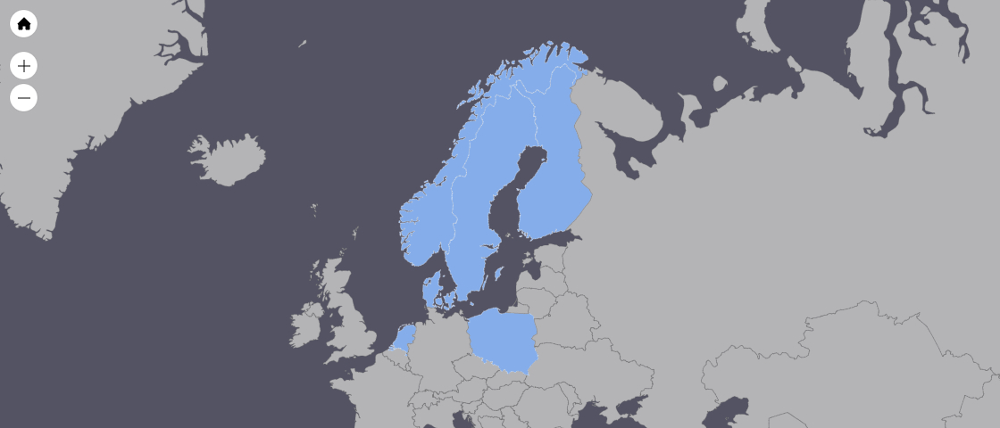

# Bekr&#228;fta [](https://travis-ci.org/Milad/bekrafta)
[Bekr&#228;fta](https://en.wiktionary.org/wiki/bekr%C3%A4fta#Swedish): A PHP library to perform common operations on Personal Identification Numbers, like: Validation, censoring the individual digits, calculating age and detecting gender.

### Supported Countries
- Denmark (CPR-Nummer)
- Finland (Henkil&#246;tunnus, Personbeteckning)
- Poland (PESEL)
- Netherlands (Burgerservicenummer) *Validation only*
- Norway (F&#248;dselsnummer)
- Sweden (Personnummer)



### Supported PHP Versions
- PHP 7.0
- PHP 7.1
- PHP 7.2

### Installation
```
composer require miladk/bekrafta
```

### Usage
This library offers one interface for all supported countries. Developers don't have to use specific countries' classes, instead there is one class that detects and uses the country and serves the appropriate values.

```php
use Bekrafta\PersonalNumber;

$oPN = new PersonalNumber('811228-9874');

// True on successful detection, false otherwise.
// True also means a valid personal number.
$oPN->detect();

// 811228-****
$oPN->getCensored();

// 35
$oPN->getAge();

// m
$oPN->getGender();

// 1981
$oPM->getYear();

// 1981-12-28
$oPM->getBirthday()
```

Or you can use a specific country if you only need that.

```php
use Bekrafta\Sweden;

$oSweden = new Sweden('811228-9874');

// True on valid personal number, false otherwise.
$oSweden->validate();

// 811228-****
$oSweden->getCensored();

// 35
$oSweden->getAge();

// m
$oSweden->getGender();

// 1981
$oSweden->getYear();

// 1981-12-28
$oSweden->getBirthday();
```

### Sweden Extended
In Sweden, some companies add the century digits as a part of the personal number, or remove the symbol between the date of birth and the four other digits. These changes are not part of the standard of the official standard. So I included to classes for Sweden:
- Sweden: Supports the official standard format.
- SwedenExtended: Supports the popular non-standard formats.

### Denmark Strict
> However, in 2007 the available sequence numbers under this system for males born on 1 January 1965 ran out, and since October 2007 personal identification numbers do not always validate using the check digit. This had been predicted and announced several years in advance. Thus, most IT systems are presumed updated to accept numbers that fail the check-digit validation.
> &mdash; [Wikipedia](https://en.wikipedia.org/wiki/Personal_identification_number_(Denmark))

Therefore, I see no use for performing a checksum on Danish personal numbers, because we will get false negatives. However, if you want to use the checksum, you can use the class DenmarkStrict which performs the checksum on the personal number, you will get false positives though.

### License
MIT
